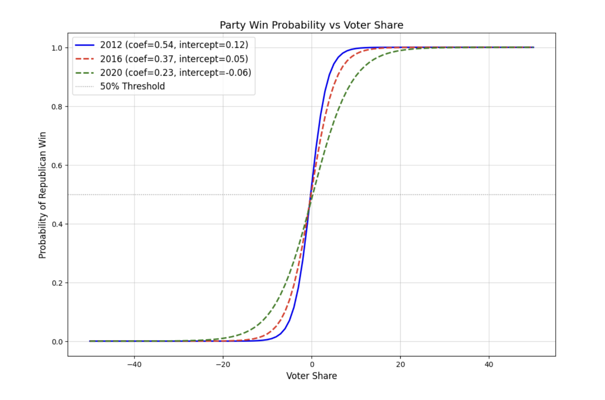
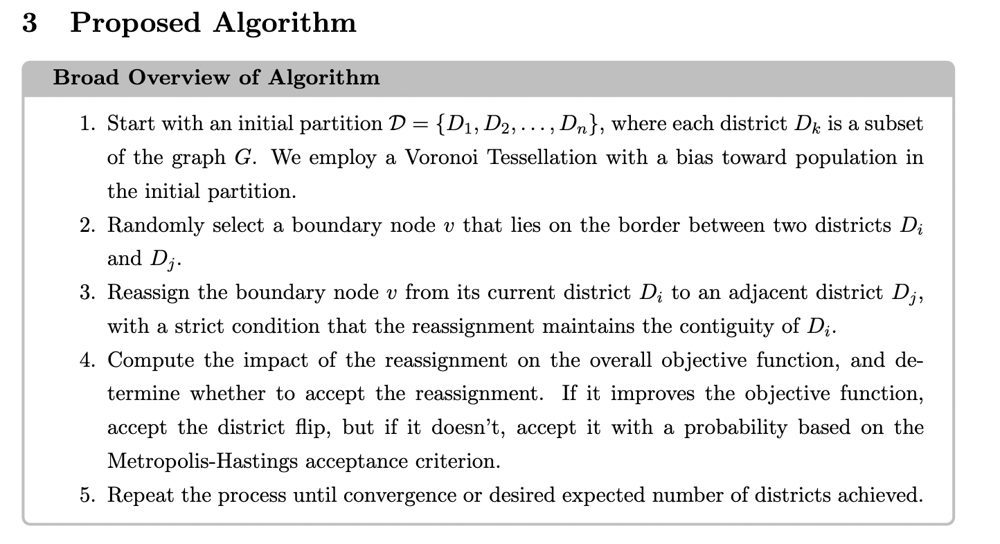
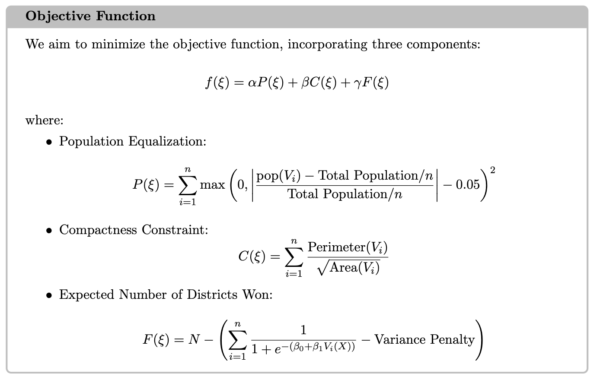
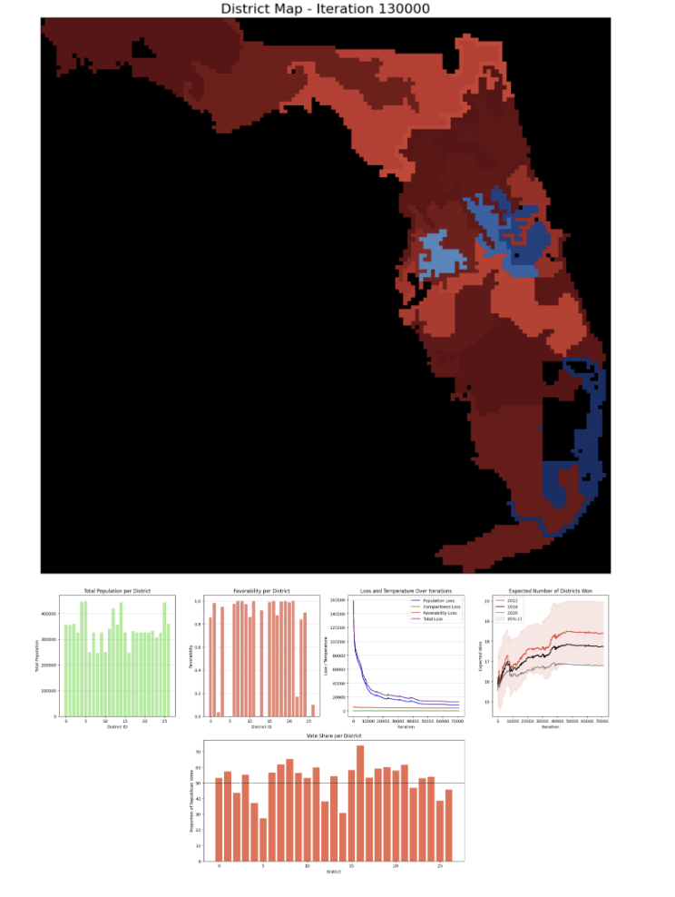
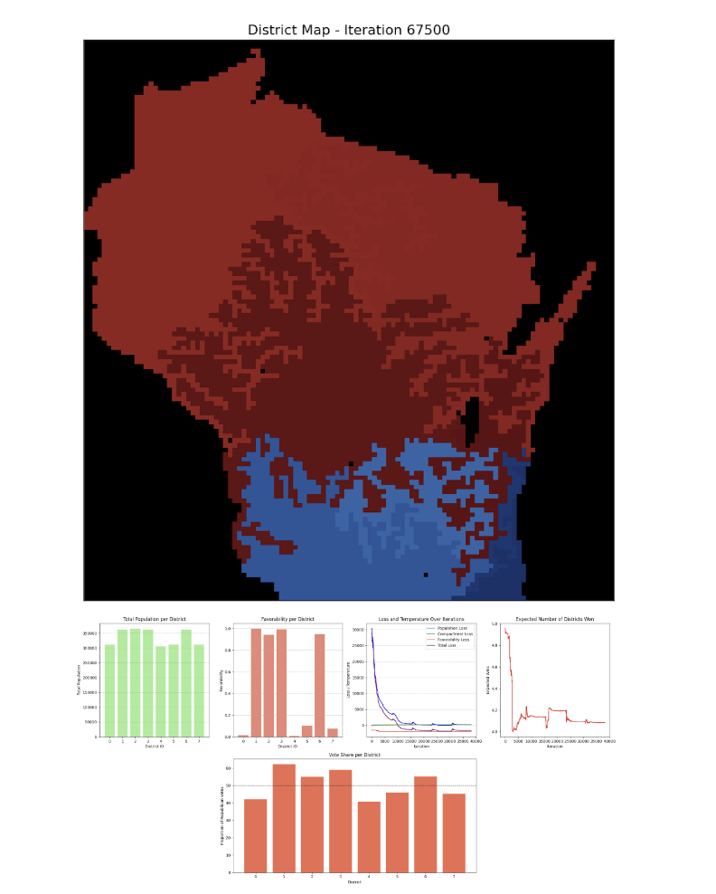
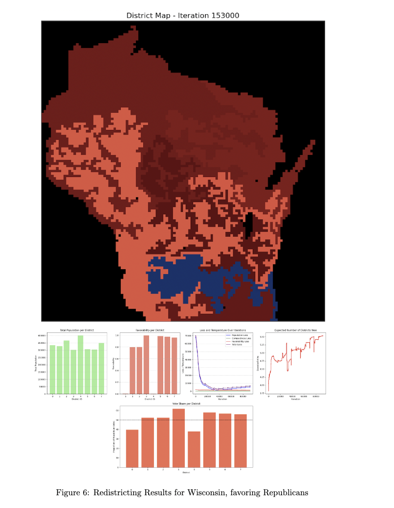

# Incorporating Risk into Algorithmic Redistricting
## Assessing and Optimizing Redistricting Algorithms with a Bias-Variance Trade-Off and Real-World Voting Data
**by Ivan Sinyavin and Owen Xu Li**
 
Final Project for S&DS 432: Optimization and Computation

Our project refits existing algorithmic redistricting methods to explicitly optimize for a specific party’s objectives. While current approaches lack explicit mechanisms and practical implementation toward the goal of optimizing toward one party or another, we develop an algorithm that explicitly optimizes towards a single
party’s objectives, incorporating past election data to redistrict maps to create districts with equal
population, a measure of compactness, and, most importantly, strategically distributed voters. Furthermore, we will use real-world voting data to construct measures of expectation and variance to
assess to what extent a certain district configuration can benefit a party — and to that extent,
use these metrics to optimize the redistricting towards a specific party’s interests. We also fill a
gap in optimizing long-term favor-ability of redistricting plans. Since the census and subsequent
redistricting (on the congressional level) occurs every ten years, as time passes, the variance of
voting result from the initial district plan often deviates. We capture the extent of this deviation
from past historical data and propose ways to incorporate the variance of these temporal shifts
into the redistricting algorithm. Therefore, our algorithm will be better equipped to ensure party
success in both the short term (1–2 years) and the long term (7–8 years).

### Data Collection

We sourced election data from the 2012, 2016, and 2020 presidential elections. Our main modeling objective by using real-word data is to understand relationship between the percentage of voters supporting a particular party in one district and that party's electoral performance in subsequent elections. This relationship informs how a slight advantage, for example, translates into varying probabilities of victory and margins of success in the short and longer terms. We analyze district-level election data following the 2010 redistricting cycle, using 2012 as our baseline for exploring how initial percentages in 2010 influence shifts in voter outcomes over subsequent election cycles. 

The logistic regression curves for 2012, 2016, and 2020 in above figure show the probability of a party's win as a function of voting share within that district, adjusted for the movement calculations/normalization based on U.S. election data. Over time, as evidenced by the progression of logistic regression curves, the predictive power of initial vote share on electoral outcomes diminishes. The sharpness of the 2012 curve reflects the immediate impact of redistricting decisions made in 2010. At that time, a small shift in voter share near the 50% threshold resulted in a significant change in the likelihood of a party's victory. As time progresses (2016 and 2020), the logistic curves flatten slightly, which suggests that initial vote share loses its predictive accuracy. As such, while redistricting efforts may optimize voter shares for the immediate future, the declining predictive power of voting shares may bias optimal redistricting efforts toward favoring solidly red/blue districts over narrower districts.

### Algorithm

## Results

### Florida, favoring Republicans

Estimated 18.5 Republican districts out of 27 districts, based on 2016 voting patters. 

### Wisconsin, favoring Democrats

Estimated 4 Democrat districts out of 8 Districts.

### Wisconsin, favoring Republicans

Estimated 6 Republican districts out of 8 Districts.

## Requirements
1. numpy
2. geopandas
3. pandas
4. rasterio
5. scipy
6. IPython
7. shapely
8. skimage
9. matplotlib
10. PIL

## Directory

`elections_data/`
Contains data from past elections used to estimate election outcomes as a function of time since redistricting.

`state_examples/`
Includes Jupyter notebooks implementing the redistricting optimization algorithm for Florida, Wisconsin, and Virginia.

`party_favoribility.ipynb`
Notebook that fits logistic curves to party favorability data based on historical voting patterns.

`project_report.pdf`
A comprehensive write-up of the full project, including methodology, implementation, and results.

`project_slides.pdf`
Summary slides presenting the key ideas and results from the project.

`read_me_pics/`
Contains supporting images (e.g., maps, diagrams) for the README or documentation.

`gifs/`
Contain final animated GIFs showing the redistricting algorithm outputs for Florida, Virginia, Wisconsin.

## Running the Algorithm
All the necessary functions are defined in the `florida_opt.ipynb`, `wisconsin_opt.ipynb`, `virginia_opt.ipynb` Jupyter notebooks in the `state_examples` folder. 
 
